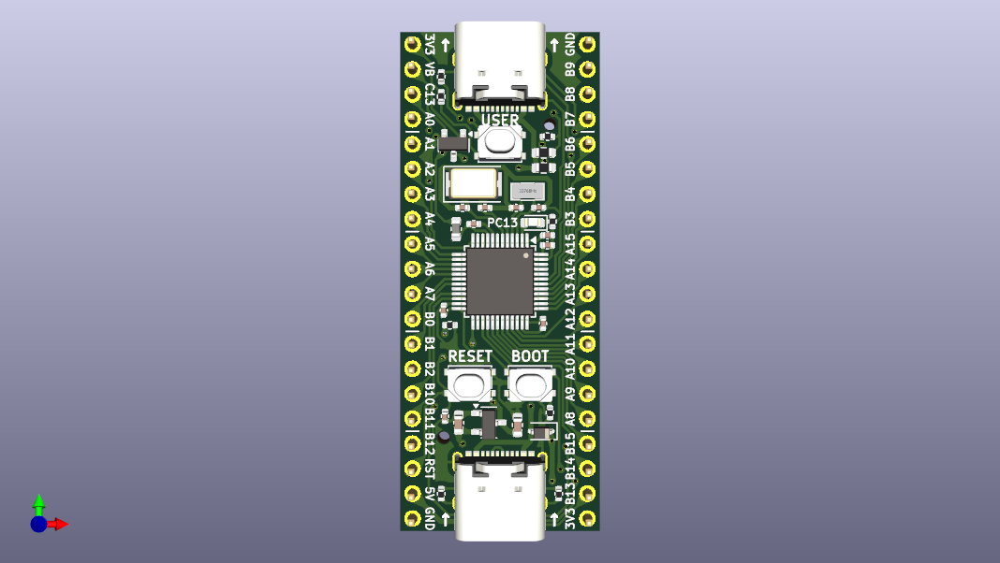

# CH32V203 Development Board

## Summary
Schematic and Board layout of CH32V203 Development Board. This project was created using [KiCAD 8](https://www.kicad.org/).

## MCU
[CH32V203C8T6](https://www.wch-ic.com/products/CH32V203.html)  
144MHz, 20KB RAM, 64KB ROM  

## Features
* CH32V203C8T6 RISC-V
* `144 MHz` maximum frequency, `64 KB` of Flash memory, `20 KB` of SRAM
* `8 MHz` crystal (High-Speed Enternal Clock)
* `32.768 KHz` crystal (Low-Speed External Clock)
* Frequency deviation of crystal has been tested (on FR-4 board with a thickness of 1.6 mm)
* White LED for `PC13`
* 2x20 side pins
* Size: `50.80 mm x 20.32 mm`
* USB Device (Type-C)
  * PA11 USB1_DM
  * PA12 USB1_DP
* USB Host (Type-C)
  * PB6 USB2_DM
  * PB7 USB2_DP
* All component parameters are already set for [JLCPCB](https://jlcpcb.com). (Thanks for [Fabrication Toolkit](https://github.com/bennymeg/Fabrication-Toolkit))
  * Tooling Hole for SMT Assembly has been added.

## Parts List
You can see parts list from the BOM below.  
[Parts List](/production/bom.csv)

## Schematic and Board image
[Board schematic](CH32V203-DevBoard.pdf)  

## LICENSE
[MIT LICENSE](/LICENSE)  
You may use it freely for personal use, but if you wish to use it for commercial purposes, I would appreciate it if you could contact me.
